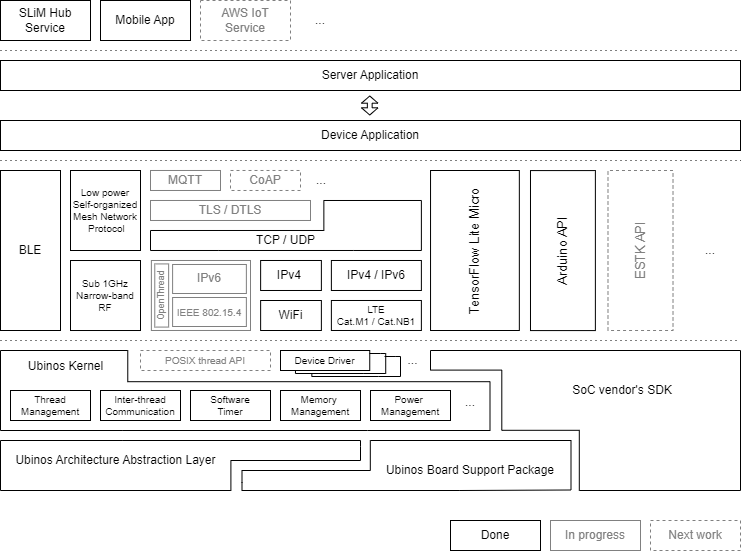

Proposed Methodology
=====================

제안하는 방법론

|

* Describe the approach to addressing the problem

|

* Presentation of Work

|

.. centered::
    Fig. 1. Fiture example

|

Table 1. Table example

+------------------------+------------+----------+----------+
| Header row, column 1   | Header 2   | Header 3 | Header 4 |
| (header rows optional) |            |          |          |
+========================+============+==========+==========+
| body row 1, column 1   | column 2   | column 3 | column 4 |
+------------------------+------------+----------+----------+
| body row 2             | Cells may span columns.          |
+------------------------+------------+---------------------+
| body row 3             | Cells may  | - Table cells       |
+------------------------+ span rows. | - contain           |
| body row 4             |            | - body elements.    |
+------------------------+------------+---------------------+

